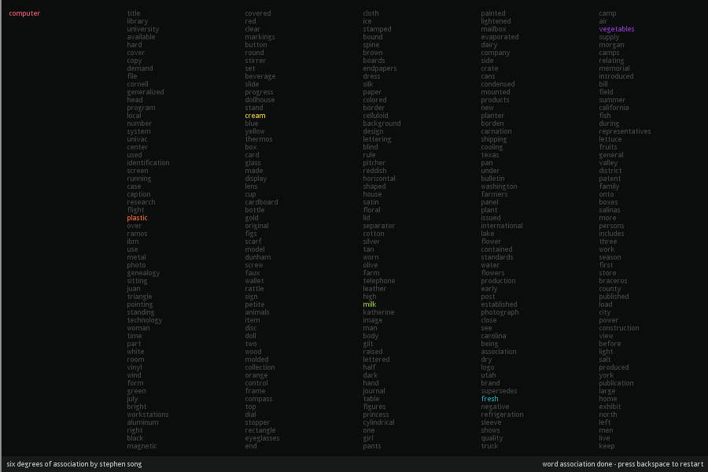

Six Degrees of Association
==========================

This application is the third project I created for LMC 2700: Intro to Computational Media. For this assignment, I was challenged to create a data portrait by crafting a visual representation of a set of data. I utilized the DPLA (Digital Public Library of America) to create an applet which can create word associations between terms that appear frequently in search queries.

### Instructions

- Type in a word to start an association with.
- When/if a list appears, select another word to start another search.
    - Keep in mind that search times may vary, so be patient!
- Press the backspace key to restart the program at any time.
- The word associations will end either when 6 associations are made or if there are no more search queries to be found.

### Project Statement

The term "six degrees of separation" describes how every person in the entire world is at most six connections away from any other person. In a similar tangent, I developed an applet called "Six Degrees of Association" to link together pairs of words. Because words carry multiple meanings in different contexts, one can explore how certain words carry different connotations based on the words that it's related to.

My applet makes use of the DPLA API to find sets of data and entries. For any given search query, I take the first 200 pages of search entries and parse through all of the description fields within the returned JSON file. Afterwards, I use data structures such as HashSets and TreeMaps to identify the most common words that appear within the descriptions provided. I also used a HashSet of "stop words" to filter out common words like "the" and "an" which are irrelevant when searching for significant words. Through my knowledge of data structures and language processing, I am able to create an applet that features relevant and important data regarding the user's input.

In particular, I made all of the search terms unique. If a word appears in a list within a degree of association, it will not appear in a future search. Hence, the order in which the user accesses their words matters, as previously associated words will not appear in subsequent searches. This is to display how many words have different meanings based on their contexts, and the direction of their searches is determined by what they don't select.

I made the stylistic choice of making everything in lowercase in order to remove any distinction between formal and normal words. As I mentioned before, every word has multiple meanings. By taking away any formal connotations of words, we can further abstract their meanings and open up the ways they can be interpreted. Likewise, my program allows for many different interpretations of what words mean. For instance, querying the word "apple" will reveal connections to both computing and agriculture, while the term "shooting" has links to homicides and basketball. The different association routes that the user takes can reveal surprising connections between words that one might have not have thought of before. Even if there are some words that are seemingly unrelated to the original search query, those terms have shown up repeatedly in the descriptions of the search queries. Thus, there must be some type of connection within those entries that may not have been realized.

I personally felt like this applet was a game to see how far I could deviate from the original word. Unlike many other data portraits or computational projects which are crafted by the creators, I created an applet that grants artistic control to the user. It's up to the user to craft a data portrait from the association of words. The user creates their own rubric for what terms are selected, and the user is free to analyze the connections they make in any way they wish. Thus, it's up to you select your search queries, and what you think of the data is completely up to you.
